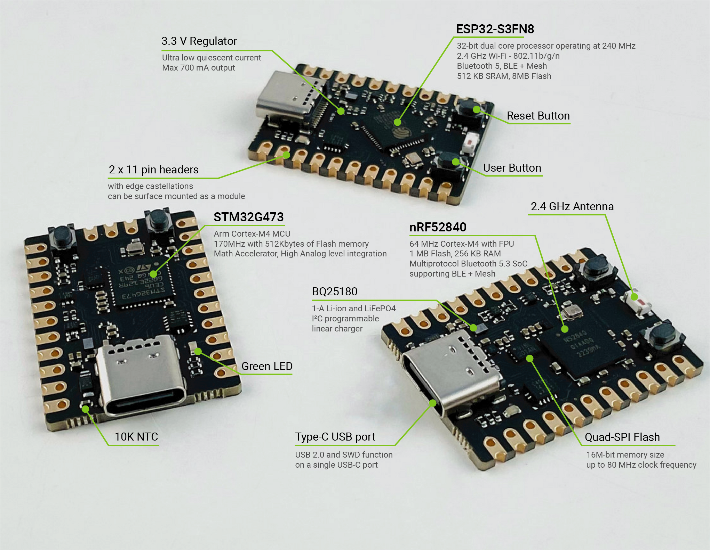
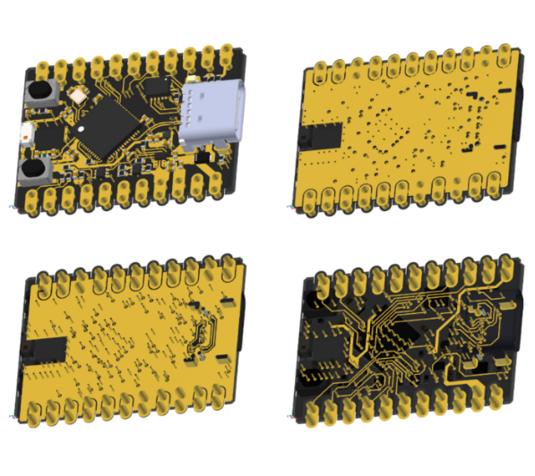
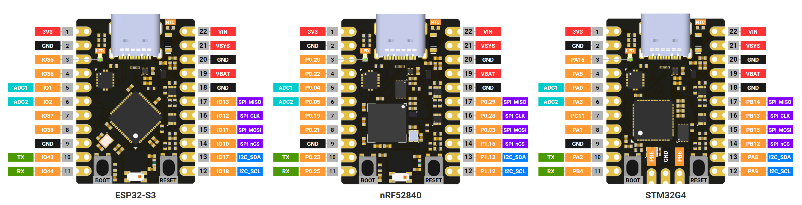

# MADI

[한국어](README_kr.md)

MADI is a development board based on various microcontroller chips with the same form factor of 21.59mm x 30mm. The board documentation can be found [here](https://docs.libmcu.org/boards/libmcu.html). And purchase can be made in [our store](https://store.libmcu.org).

MADI comes with an open source [SDK](https://github.com/libmcu/madi). The SDK is designed to develop firmware that are not dependent on the type of microcontroller or manufacturer's platform. It helps you focus on your application development rather than platform-specific or manufacturer-specific development environment. Please refer to our [quickstart quide](https://docs.libmcu.org/quickstart).

## Features

* Three different MCUs are now available:
  - [ESP32-S3](https://docs.libmcu.org/boards/libmcu.html#madi-esp32)
  - [nRF52840](https://docs.libmcu.org/boards/libmcu.html#madi-nrf52)
  - [STM32G4](https://docs.libmcu.org/boards/libmcu.html#madi-stm32)
* TI’s advanced battery management IC, BQ25180, with [fully supported driver](https://docs.libmcu.org/api/pm.html#bq25180)
* 2 x 11 pin headers with edge castellations
  - can be surface mounted as a module
* External Quad-SPI Flash with eXecute In Place(XIP)
* Serial Wire Debug(SWD) via USB C-type port
* Green LED, User button and Reset button
* 4-layer PCB design for the better signal integrity and power integrity

## Pinout

### 2 x 11 Pin Header

| No. | ESP32-S3 | nRF52840 | STM32G4 | Note                  |
| --- | -------- | -------- | ------- | --------------------- |
|   1 | 3V3      | 3V3      | 3V3     | 3.3V LDO output       |
|   2 | GND      | GND      | GND     |                       |
|   3 | IO35     | P0.20    | PA.15   |                       |
|   4 | IO36     | P0.22    | PA.5    |                       |
|   5 | IO1      | P0.04    | PA.0    | ADC1                  |
|   6 | IO2      | P0.05    | PA.3    | ADC2                  |
|   7 | IO37     | P0.19    | PC.11   |                       |
|   8 | IO38     | P0.21    | PA.1    |                       |
|   9 | GND      | GND      | GND     |                       |
|  10 | IO43     | P0.23    | PA.2    | UART_TX               |
|  11 | IO44     | P0.25    | PB.4    | UART_RX               |
|  12 | IO18     | P1.12    | PA9     | I2C_SCL               |
|  13 | IO17     | P1.13    | PA8     | I2C_SDA               |
|  14 | IO10     | P1.15    | PB12    | SPI_nCS               |
|  15 | IO11     | P0.03    | PB15    | SPI_MOSI              |
|  16 | IO12     | P0.28    | PB13    | SPI_CLK               |
|  17 | IO13     | P0.29    | PB14    | SPI_MISO              |
|  18 | GND      | GND      | GND     |                       |
|  19 | VBAT     | VBAT     | VBAT    | Battery Connection    |
|  20 | GND      | GND      | GND     |                       |
|  21 | VSYS     | VSYS     | VSYS    | BQ25180 System Output |
|  22 | VIN      | VIN      | VIN     | External power input  |

### Pinmap internally connected

| Function    | ESP32-S3 | nRF52840 | STM32G4 |
| ----------- | -------- | -------- | ------- |
| GREEN LED   | IO35     | P0.20    | PA.15   |
| BQ25180 IRQ | IO14     | P0.26    | PC.6    |
| BQ25180 SDA | IO17     | P1.13    | PA.8    |
| BQ25180 SCL | IO18     | P1.12    | PA.9    |
| EN_VBAT_MON | IO4      | P0.27    | PB.2    |
| VBAT_MON    | IO7      | P0.31    | PC.4    |
| USER BUTTON | IO0      | P1.07    | PB.8    |

## Recommended Operating Conditions

| Parameter           | Value          |
| ------------------- | -------------- |
| Operating Temp Max. | 85 °C          |
| Operating Temp Min. | -40 °C         |
| VIN                 | 4.35 V ~ 5.5 V |
| VBAT                | 2.2 V ~ 4.6 V  |

